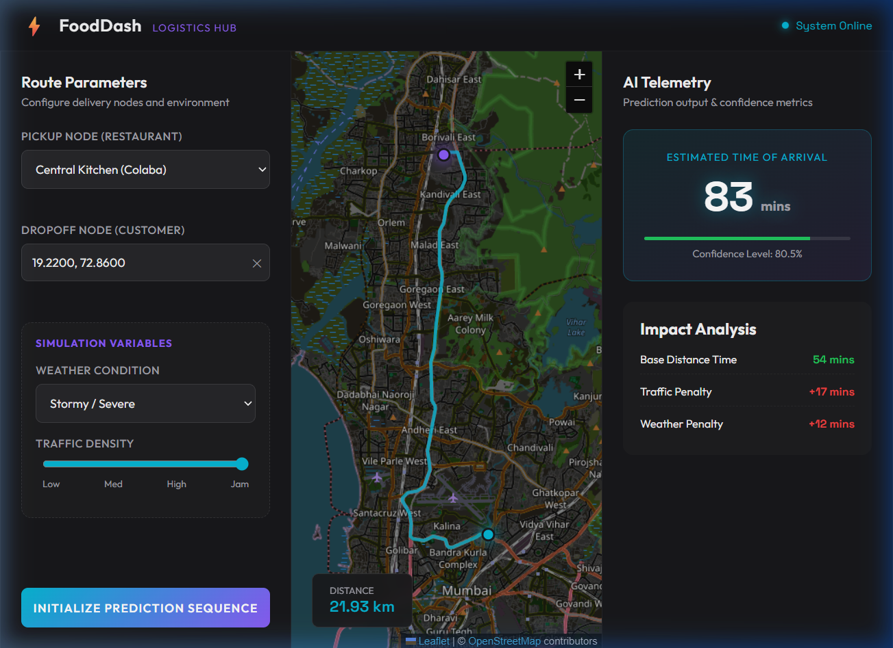

# Food-Dash

> **AI-Powered Delivery ETA Prediction & Predictive Logistics Hub**

Live Demo: [Deploying today](https://vercel.com) *(Update with your Vercel URL)*

---

## Screenshot



> _Place your application screenshot in `assets/screenshot.png` or update the path above with your hosted preview URL._

---

## Tech Stack

### Frontend
- **HTML5 & CSS3**: Custom dark-mode neon glassmorphism UI built with modern typography (`Outfit` and `Space Grotesk`).
- **Vanilla JavaScript (ES6+)**: Asynchronous state management, DOM manipulation, and dynamic telemetry rendering.
- **Leaflet.js**: Interactive geospatial map engine rendering custom neon markers, viewport bounds, and route paths.
- **OpenRouteService (ORS) API**: Real-world road network routing, waypoint navigation, and turn-by-turn driving distance calculation.

### Backend
- **Python 3**: Core backend execution environment.
- **Flask**: Lightweight RESTful microframework serving the `/predict` API endpoint.
- **Flask-CORS**: Cross-Origin Resource Sharing handling seamless communication between frontend and backend.

### Machine Learning & Data Science
- **Scikit-Learn**: Model architecture utilizing `RandomForestRegressor` with custom hyperparameter tuning (`n_estimators=100`, `max_depth=10`).
- **Pandas & NumPy**: Tabular data manipulation, missing value imputation, string cleaning, and array computations.
- **Mathematical Feature Engineering**: Haversine formula implementation for computing geodetic spherical distances from raw latitude/longitude coordinates.
- **Pickle**: Serialization pipeline for model weights (`model.pkl`) and categorical encoders (`preprocessor.pkl`).

---

## Features I built

- **Interactive Geospatial Dispatch Map**:
  - Interactive Leaflet-powered viewport with custom-styled cyan and purple neon nodes.
  - Multi-city pickup hub selection across **Mumbai** (Colaba, Andheri West, Bandra), **Delhi** (Connaught Place, Saket, Lajpat Nagar), and **Bangalore** (MG Road, Koramangala, Hebbal).
  - Click-to-pin customer dropoff location with instant coordinate geocoding and real-time polyline rendering.

- **Real Road Turn-by-Turn Routing**:
  - Connects to OpenRouteService driving-car routing API to fetch true road network paths and driving distances.
  - Automatic fallback cascade: seamlessly degrades to mathematical Haversine straight-line distance if API limits are reached or network drops occur.

- **Dynamic Environmental Simulators**:
  - **Weather Conditions**: Clear/Sunny, Cloudy/Overcast, Rainy/Wet, and Stormy/Severe.
  - **Traffic Density**: 4-level granular slider simulating Low, Medium, High, and Gridlock (Jam) conditions.

- **Hybrid ML + Physics Inference Engine**:
  - Blends trained machine learning pattern recognition with real-world physical transit constraints.
  - Delivers instant, deterministic ETA predictions in minutes.

- **Distance-Compounded Weather & Traffic Penalty Engine**:
  - Predicts real-world delivery delays by decomposing total delivery time into a **Physics Base Transit Time** and dynamic **Weather & Traffic Delay Penalties**.
  - Rather than applying a naive flat delay, penalties scale proportionally with travel distance: bad weather and gridlock compound significantly the further the driver travels.
  - **Live Telemetry Output**:
    - **Base Distance Time**: Physical preparation and transit floor ($10\text{ mins prep} + 2\text{ mins/km}$).
    - **Traffic Penalty**: Congestion delay calculated from traffic density (Low $\rightarrow$ Med $\rightarrow$ High $\rightarrow$ Jam).
    - **Weather Penalty**: Adverse condition delay derived from weather severity (Sunny $\rightarrow$ Cloudy $\rightarrow$ Rainy $\rightarrow$ Stormy).
    - **Confidence Score**: Dynamic confidence percentage that decreases under high environmental volatility and extreme distances.

- **Operational Boundary Guard**:
  - Automated distance validator that detects if a selected dropoff point exceeds the maximum 100km urban operational limit, triggering an animated on-screen warning alert.

- **Dedicated Analytics Dashboard**:
  - Secondary analytics interface (`dashboard.html`) tracking model accuracy metrics (**Mean Absolute Error: 8.04 mins**) and feature importance distribution rankings.

---

## What I learned / Optimization

### 1. Distance-Scaled Environmental Penalties (Solving Random Forest Extrapolation)
* **The Core Insight**: In real-world food logistics, environmental friction (weather and traffic) is **distance-dependent**. A severe rainstorm or traffic jam causes a mild 3-minute delay on a 1.5km trip, but compounds into an exponential 20–30 minute delay across a 25km cross-city journey.
* **The Problem**: Tree-based ensembles like Random Forest cannot extrapolate values outside the numerical range of their training set (in this dataset, delivery trips were capped under 20km). When queried on long-distance trips (e.g., 40–80km), the model plateaued and returned an inaccurate ceiling of ~45 minutes.
* **The Solution**: Developed a hybrid architecture in `predictor.py`. The machine learning model is queried at a standardized baseline distance (10km) under current weather and traffic conditions to extract the non-linear **penalty multiplier**:
  $$\text{Penalty Multiplier} = \frac{\text{Model Predicted Time at 10km (Current Conditions)}}{\text{Model Predicted Time at 10km (Sunny + Low Traffic)}}$$
  $$\text{Base Time} = 10\text{ mins (kitchen preparation)} + (\text{Distance in km} \times 2\text{ mins/km})$$
  $$\text{Predicted ETA} = \text{Base Time} \times \max(1.0, \text{Penalty Multiplier})$$
  $$\text{Total Penalty} = \text{Predicted ETA} - \text{Base Time}$$
  $$\text{Weather Delay} = \text{Total Penalty} \times 40\% \quad\Big|\quad \text{Traffic Delay} = \text{Total Penalty} \times 60\%$$
  This ensures penalties scale realistically across any route distance while preserving the complex non-linear relationships learned by the Random Forest.

### 2. Guarding Against Real-World Dataset Noise
* **The Problem**: Real-world delivery records often contain noise or anomalies where a "Sunny" trip took longer than a "Stormy" trip due to unmeasured events (e.g., kitchen delays), occasionally causing the model to output a penalty multiplier $< 1.0$.
* **The Solution**: Added an automated lower-bound constraint (`penalty_multiplier = max(1.0, penalty_multiplier)`) ensuring weather and traffic penalties never produce negative delay times.

### 3. Geodetic Feature Engineering via Haversine Formula
* **The Problem**: Raw GPS coordinates (Latitude & Longitude) cannot be directly correlated with travel time by standard regression models without understanding planetary curvature.
* **The Solution**: Implemented the Haversine trigonometric formula in data preprocessing to compute the great-circle distance between delivery hubs and customers:
  $$d = 2R \arcsin\left(\sqrt{\sin^2\left(\frac{\Delta \phi}{2}\right) + \cos(\phi_1)\cos(\phi_2)\sin^2\left(\frac{\Delta \lambda}{2}\right)}\right)$$
  This converted arbitrary spatial coordinates into a clean numerical feature (`Distance_km`), boosting predictive correlation significantly.

### 4. Dual-Tier Fail-Safe Routing Architecture
* **The Problem**: Depending entirely on third-party routing APIs creates a single point of failure if request quotas are exceeded or internet connectivity fluctuates.
* **The Solution**: Implemented an automated `try...catch` fallback pipeline in `script.js`. If the OpenRouteService API returns an error or rate limit, the frontend automatically draws a dashed geodesic trajectory using Haversine calculation, ensuring zero disruption to the user experience.

---

## How to run locally

### Prerequisites
- **Python 3.9+** installed
- Modern Web Browser (Chrome, Edge, Firefox, Safari)
- *(Optional)* VS Code with Live Server extension

---

### 1. Clone the Repository
```bash
git clone https://github.com/AnmolRajSrivastava/Food-Dash.git
cd Food-Dash
```

---

### 2. Backend Setup & Run

1. Navigate to the `backend` directory:
   ```bash
   cd backend
   ```

2. Create and activate a virtual environment:
   - **Windows (PowerShell):**
     ```powershell
     python -m venv venv
     .\venv\Scripts\Activate.ps1
     ```
   - **macOS / Linux:**
     ```bash
     python3 -m venv venv
     source venv/bin/activate
     ```

3. Install required Python dependencies:
   ```bash
   pip install -r requirements.txt
   ```

4. Launch the Flask API server:
   ```bash
   python app.py
   ```
   *The server will start at `http://127.0.0.1:5000`.*

---

### 3. Frontend Setup & Run

In a separate terminal window, open or serve the `frontend` folder:

- **Option A (Python Simple Server):**
  ```bash
  cd frontend
  python -m http.server 8000
  ```
  Open `http://localhost:8000` in your web browser.

- **Option B (Direct Browser Launch):**
  Simply double-click or open `frontend/index.html` directly in your favorite browser.

- **Option C (VS Code Live Server):**
  Right-click `frontend/index.html` in VS Code and select **"Open with Live Server"**.

---

### 4. (Optional) Retrain the Machine Learning Model

To retrain the Random Forest Regressor from the raw training dataset:
```bash
cd model
python train_model.py
```
This cleans `data/train.csv`, re-engineers the distance features, trains the `RandomForestRegressor`, and exports updated `model.pkl` and `preprocessor.pkl` files into `model/`.
